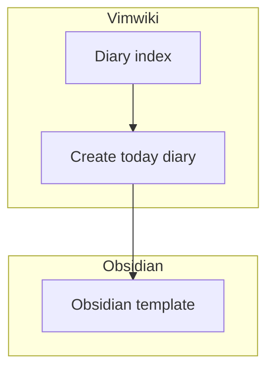

# Vimwiki

[CheatSheet](https://gist.github.com/drkarl/4c503bccb62558dc85e8b1bc0f29e9cb)

## Diary 작성하기
생성과 index는 Vimwiki를 사용하고, 템플릿 생성은 Obsidian을 사용한다.
Vimwiki에서는 Template을 따로 지원하지 않는것 같아서 Obsidian을 사용한다.




## Link 생성
- `[[]]` 내에서 `<C-x> <C-o>`를 누르면 wiki page 경로를 확인할 수 있다.
- Obsidian에서 `[[]]`를 입력하면 페이지 리스트가 뜬다.  이 경우 경로포함하여 생성해주도록 한다.
  (그렇지 않으면 Vimwiki에서는 경로를 다르게 볼 수 있음)

Example
```
[Page Title](../frontend/__index.md)
[[../frontend/__index.md]]
[[../frontend/__index.md|Page Title]]
```


## 한계점
Obsidian과 Vimwiki의 Link 생성방식에 차이점이 있음
보통 Vimwiki에서는 텍스트에 Enter를 치면,  같은 디렉토리 내에서 페이지가 생성되어 링크되는데,
Obsidian에서는 root 경로를 바라보게 됨
둘다 호환되는 링크를 만드려면 아래처럼 절대 경로로 작성해야함
```
[[/config/test]]
```

Vimwiki에서는 자동완성 방식으로 [Omni Completion](https://vim.fandom.com/wiki/Omni_completion)을 사용한다


## 키바인딩
모든 단축키(커스텀한 단축키 포함)

| 단축키               | 설명                                                              | default/custom |
| ---                  | ---                                                               | ---            |
| `<C-x> <C-o>`        | `[[]]` 내에서 wiki page 경로 확인하기                             | default        |
| `<leader>ww`         | Wiki index                                                        | default        |
| `<leader>w<leader>i` | Update Diary index                                                | default        |
| `<leader>wi`         | Diary index                                                       | default        |
| `<leader>w<leader>w` | Create today diary                                                | default        |
| `<leader>w<leader>l` | Obsidian template                                                 | custom         |
| <Backspace>          | GoBackLink (이전 페이지로 돌아감)                                 | default        |
| <c-@>                | toggle list item (https://github.com/vimwiki/vimwiki/issues/1061) | default        |


## config 설정시 주의사항

아래처럼 config에 vimwiki_list를 넣으면 path를 제대로 찾지 못함
```lua
return {
  {
    "vimwiki/vimwiki",
    cmd = { "VimwikiIndex", "VimwikiUISelect" },
    keys = {
      { "<Leader>W", "<cmd>VimwikiIndex<CR>", { noremap = true } },
    },
    init = function()
      vim.g.vimwiki_global_ext = 0
      vim.g.vimwiki_use_calendar = 1
      vim.g.vimwiki_hl_headers = 1
      vim.g.vimwiki_hl_cb_checked = 1
      vim.g.vimwiki_autowriteall = 0
      vim.g.vimwiki_listsym_rejected = "✗"
      vim.g.vimwiki_listsyms = "✗○◐●✓"
    end,
    config = function()
      vim.g.vimwiki_key_mappings = {
        all_maps = 1,
        global = 1,
        headers = 1,
        text_objs = 1,
        table_format = 1,
        table_mappings = 1,
        lists = 1,
        links = 1,
        html = 1,
        mouse = 0,
      }
      vim.g.vimwiki_list = {
        { path = "~/Vault/", syntax = "markdown", ext = ".md" },
      }
    end,
  },
}
```

아래처럼 init에 넣어야 제대로 동작함 (아래는 ChatGPT의 답변)
```
lazy.nvim에서는 Vim 플러그인을 초기화할 때 특정 단계에 따라 함수를 실행하게 되어 있습니다. 주어진 코드에서 `init` 함수는 Vimwiki 플러그인이 로드되기 전에 실행되고, `config` 함수는 플러그인이 로드된 후에 실행됩니다.
그런데 주어진 코드를 보면, `cmd = { "VimwikiIndex", "VimwikiUISelect" }` 부분이 있습니다. 이는 Vimwiki 플러그인이 처음으로 `VimwikiIndex` 또는 `VimwikiUISelect` 명령이 실행되는 시점에 로드되도록 설정한 것입니다.
따라서, `VimwikiIndex` 명령이 실행되면서 Vimwiki 플러그인이 로드되고, 이때 `init` 함수가 먼저 실행되지만, `config` 함수가 실행되기 전에 `VimwikiIndex` 명령이 실행되어 기본 설정 디렉토리인 `~/vimwiki`를 생성하려고 시도하는 것 같습니다.
이 문제를 해결하려면, `config` 부분의 설정을 `init` 함수로 옮기면 될 것 같습니다. 이렇게 하면 플러그인이 로드되기 전에 미리 설정이 적용되어, `VimwikiIndex` 명령이 실행되는 시점에 이미 `vim.g.vimwiki_list`가 설정된 상태가 됩니다.
이렇게 수정하면, `VimwikiIndex` 명령이 실행되기 전에 `~/Vault/` 디렉토리가 설정되므로 해당 디렉토리에 Vimwiki를 생성하려고 시도할 것입니다.
```

```lua
return {
  {
    "vimwiki/vimwiki",
    init = function()
      vim.g.vimwiki_global_ext = 0
      vim.g.vimwiki_use_calendar = 1
      vim.g.vimwiki_hl_headers = 1
      vim.g.vimwiki_hl_cb_checked = 1
      vim.g.vimwiki_autowriteall = 0
      vim.g.vimwiki_listsym_rejected = "✗"
      vim.g.vimwiki_listsyms = "✗○◐●✓"

      -- Moved from config
      vim.g.vimwiki_key_mappings = {
        all_maps = 1,
        global = 1,
        headers = 1,
        text_objs = 1,
        table_format = 1,
        table_mappings = 1,
        lists = 1,
        links = 1,
        html = 1,
        mouse = 0,
      }
      vim.g.vimwiki_list = {
        { path = "~/Vault/", syntax = "markdown", ext = ".md" },
      }
    end,
  },
}
```

